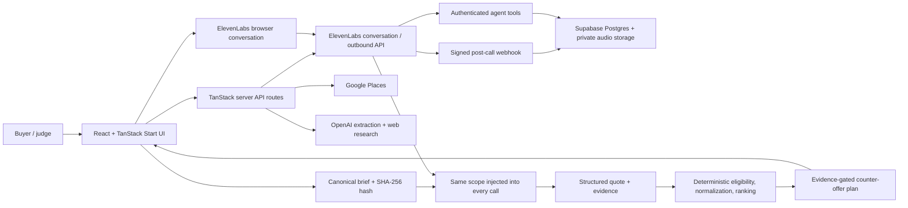

# Architecture and setup

## System overview

Lilly is a TypeScript full-stack application built with React 19 and TanStack Start. The browser
owns the guided campaign experience; server routes protect provider credentials and perform live
research and extraction; ElevenLabs supplies conversational voice; Supabase provides the durable
audit model and Edge Functions for private tokens, signed webhook ingestion, and agent tools.



## End-to-end data flow

1. Intake from form, voice, or a document updates one `CateringBrief` shape.
2. Confirmation serializes only the canonical commercial fields and authority settings. SHA-256 of
   that JSON becomes `contentHash`.
3. Market research discovers vendors through Google Places and asks OpenAI web search for current
   price-bearing evidence. The server rejects source URLs not present in provider results.
4. Every initial call receives the canonical brief JSON, hash, version, call-session ID, mode, and
   vendor name as ElevenLabs dynamic variables.
5. Post-call extraction fetches the ElevenLabs transcript and asks OpenAI for a strict quote object:
   outcome, six cost buckets, deposit, cancellation, validity, notes, and read-back status.
6. `finalizeVendorQuote` attaches transcript/recording evidence and the exact brief snapshot.
7. `normalizeQuote` recomputes total cost from non-negative components and applies hard eligibility
   gates. Only eligible offers receive a score.
8. `buildNegotiationPlan` selects a cheaper eligible alternative with the same brief hash and
   transcript evidence. It returns one permitted price-gap claim and one scope-preserving ask.
9. A callback creates a `NegotiationRecord` retaining initial total, final total, delta, changed
   terms, and the leverage evidence ID.

## Explainable decision rules

An offer is excluded from ranking when any of the following is true:

- the outcome is not an itemized quote;
- the call outcome is not finalized;
- a required line item remains unknown;
- completeness is below 85%;
- evidence confidence is below 75%;
- transcript evidence is missing;
- the quote does not reference the confirmed brief hash;
- the market reference is incomplete; or
- the normalized total is not positive.

For eligible offers, the score is capped at 100 and combines:

- price relative to the buyer's absolute maximum: up to 45 points;
- evidence confidence: up to 25 points;
- quote completeness: up to 20 points; and
- cancellation flexibility: up to 10 points.

A total below 70% of the market median is visibly flagged for verification. It is not automatically
treated as a bargain.

## Application routes

| Route                       | Method | Purpose                                                             | Server credentials                            |
| --------------------------- | ------ | ------------------------------------------------------------------- | --------------------------------------------- |
| `/`                         | GET    | Workspace/project landing page                                      | None                                          |
| `/campaign`                 | GET    | Guided six-stage sourcing workflow                                  | None for sample data                          |
| `/api/market-research`      | POST   | Streams Places discovery and grounded benchmark progress as NDJSON  | `GOOGLE_PLACES_API_KEY`, `OPENAI_API_KEY`     |
| `/api/parse-brief-document` | POST   | Extracts brief fields from PDF, DOCX, or PPTX                       | `OPENAI_API_KEY`                              |
| `/api/extract-quote`        | POST   | Fetches a conversation transcript and returns a strict quote        | `ELEVENLABS_API_KEY`, `OPENAI_API_KEY`        |
| `/api/outbound-call`        | POST   | Starts an ElevenLabs/Twilio outbound call with frozen brief context | ElevenLabs API key, agent ID, phone-number ID |
| `/api/call-status`          | GET    | Proxies ElevenLabs conversation status                              | `ELEVENLABS_API_KEY`                          |
| `/api/maps-key`             | GET    | Supplies a browser-restricted Maps key to the map component         | One supported Google Maps key variable        |

## Supabase functions

| Function             | Responsibility                                                                                                                            |
| -------------------- | ----------------------------------------------------------------------------------------------------------------------------------------- |
| `elevenlabs-token`   | Exchanges the server-held ElevenLabs key for a short-lived private WebRTC token.                                                          |
| `elevenlabs-webhook` | Verifies the ElevenLabs HMAC signature, upserts call/transcript metadata, and stores audio in a private bucket.                           |
| `agent-tools`        | Authenticated brief updates, quote-fact capture, completeness checks, evidence retrieval, counter-offer policy, and outcome finalization. |
| `market-baseline`    | Optional Supabase-hosted market-research path retained for future deployment choices.                                                     |

The initial migration creates campaigns, immutable brief versions, market references, vendors, call
sessions, transcript turns, quote versions and line items, evidence items, negotiation plans, and a
private `call-audio` bucket. Row-level security is enabled; deployment must add policies appropriate
to the chosen authentication model before direct client table access.

## Environment configuration

Copy `.env.example` to `.env.local` and populate only the features you will run.

### Live research and document intake

| Variable                   | Used for                                                         |
| -------------------------- | ---------------------------------------------------------------- |
| `OPENAI_API_KEY`           | Document parsing, market web research, and transcript extraction |
| `OPENAI_MODEL`             | Market-research model; defaults to `gpt-5.6-terra`               |
| `GOOGLE_PLACES_API_KEY`    | Server-side local vendor discovery                               |
| `VITE_GOOGLE_MAPS_API_KEY` | Optional browser map; restrict by domain and Maps API            |

### ElevenLabs voice and calling

| Variable                               | Used for                                           |
| -------------------------------------- | -------------------------------------------------- |
| `ELEVENLABS_API_KEY`                   | Server-side conversation access and outbound calls |
| `ELEVENLABS_INTAKE_AGENT_ID`           | Server-side intake-agent configuration             |
| `ELEVENLABS_PROCUREMENT_AGENT_ID`      | Procurement and negotiation calls                  |
| `ELEVENLABS_PHONE_NUMBER_ID`           | ElevenLabs/Twilio outbound number                  |
| `ELEVENLABS_WEBHOOK_SECRET`            | HMAC verification of post-call events              |
| `LILLY_AGENT_TOOL_SECRET`              | Authentication for ElevenLabs webhook tools        |
| `VITE_ELEVENLABS_INTAKE_AGENT_ID`      | Browser-safe intake agent identifier               |
| `VITE_ELEVENLABS_PROCUREMENT_AGENT_ID` | Browser-safe procurement agent identifier          |

Twilio account variables are retained for provider configuration, while the application calls
ElevenLabs' native Twilio outbound endpoint rather than exposing Twilio credentials to the browser.

### Supabase

| Variable                    | Used for                                                  |
| --------------------------- | --------------------------------------------------------- |
| `SUPABASE_URL`              | Server/Edge Function project URL                          |
| `SUPABASE_ANON_KEY`         | Server-side anonymous project key where needed            |
| `SUPABASE_SERVICE_ROLE_KEY` | Edge Function persistence; never expose to the browser    |
| `VITE_SUPABASE_URL`         | Browser-safe project URL for private voice-token requests |
| `VITE_SUPABASE_ANON_KEY`    | Browser-safe anonymous key for the token function         |

Never prefix a provider secret or service-role key with `VITE_`. Any Google key returned to the map
component is effectively browser-visible and must have strict API and website restrictions.

## Local development

```bash
npm install
copy .env.example .env.local
npm run dev
```

Useful commands:

```bash
npm run test
npm run build
npm run lint
npm run elevenlabs:create-agent
npm run elevenlabs:update-agent
```

The current production build targets a Cloudflare module through Nitro. `npm run build` creates
`.output/`; that generated directory and `node_modules/` should not be included in source archives.

## Repository structure

```text
src/
  components/           Guided workflow and voice-call UI
  lib/                  Canonical brief, research client, deterministic procurement rules
  routes/               Pages and secret-bearing server API routes
elevenlabs/
  prompts/              Lilly, intake, and procurement prompt contracts
  demo-personas.md      Consenting role-player behavior cards
  tool-contracts.md     Agent-to-backend request/response contracts
scripts/                ElevenLabs agent creation and update scripts
supabase/
  functions/            Token, webhook, policy tools, optional research function
  migrations/           Postgres audit and evidence schema
fixtures/               Transparent sample catering brief
docs/                   Judge, architecture, planning, and design documentation
```

## Security and authority boundaries

- Provider secrets are read only in server routes or Edge Functions.
- Browser voice uses a short-lived token when Supabase is configured.
- Webhooks reject missing, stale, or invalid HMAC signatures.
- Agent tools require `x-lilly-tool-secret`.
- Competitive claims require a leverage-eligible evidence record with sufficient confidence.
- Counteroffers that change scope or imply a conditional commitment are escalated to the user.
- The canonical authority object always sets `mayBook: false`.
- Audio storage is private and database tables have row-level security enabled.

## Current boundaries and next production steps

The active campaign is currently held in React memory and the workspace list in local storage. The
database schema and Edge Functions provide the production persistence model, but the UI does not yet
reload full campaigns from Supabase. Before production use, add authenticated RLS policies, connect
UI mutations/queries to the audit tables, add retention/consent controls for recordings, implement
provider retries and idempotency, and run legal review for AI disclosure and call recording in each
operating jurisdiction.
